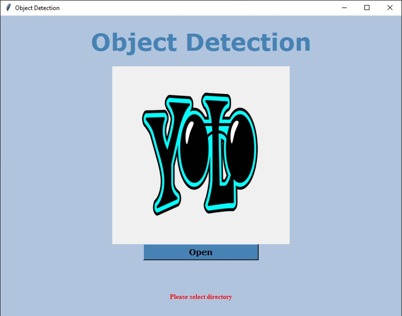
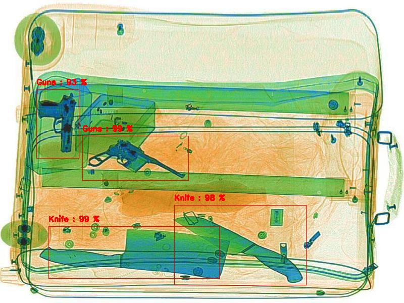
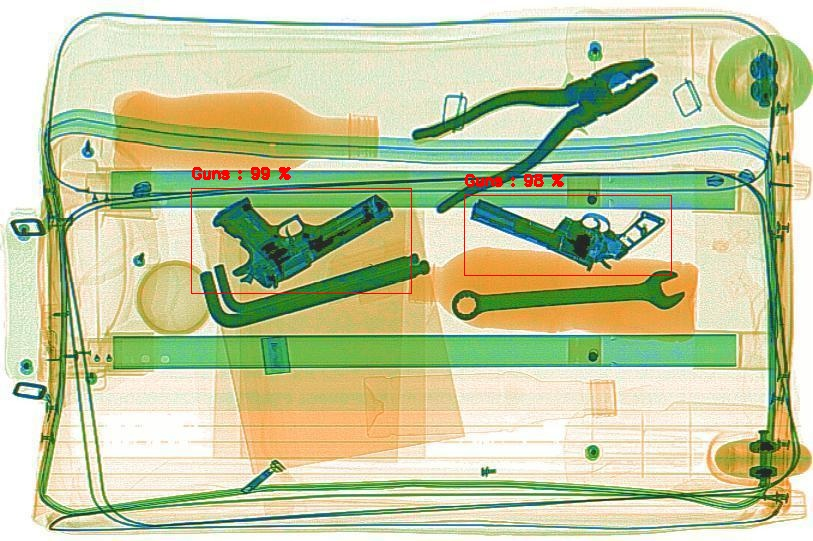

#yolov3 custom object detector 
### Use the YOLOv3_Tutorial.ipynb note book in google colab to train your own object detector
### Use the wieghts and .cfg file that are saved in your google drive after training yolov3 detector
### You can download [Yolov4.weights](https://drive.google.com/file/d/1nbCEW-gG08zakvGkTdL319_RUqTiNFLQ/view?usp=sharing) [Yolov4.cfg](https://drive.google.com/file/d/1ZHokj9JKVBh9kQy98rwFj2lIZDEhjeiO/view?usp=sharing)  

# Dangerous_object_Detector
<!-- -->
<!-- -->
<!-- -->
<!-- -->
